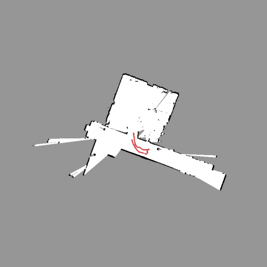
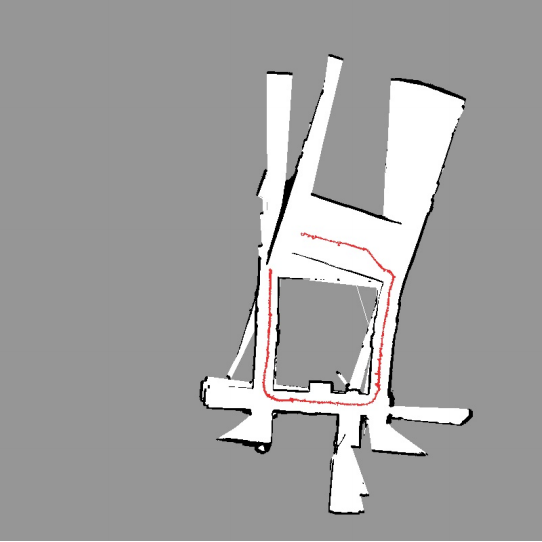
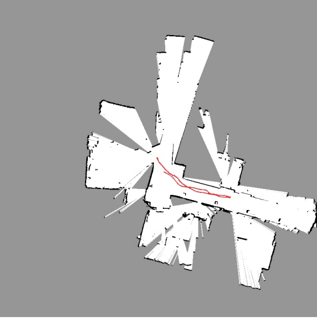
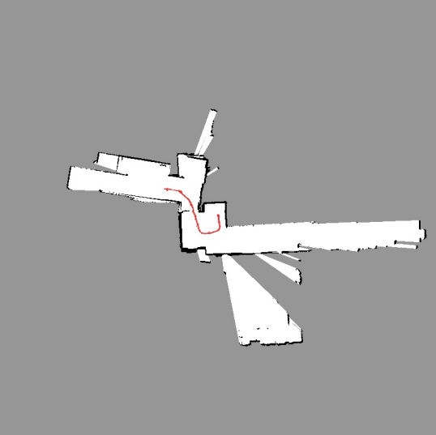

# Particle Filter based SLAM
This project is done as part of course ESE 650: Learning in Robotics at Upenn. The project involved implementing Simultaneous Localization and Mapping based on LIDAR scan and Odometry data. The SLAM flow is shown in picture below.

<p float="left">
  
  
</p>


# Results
<table>
  <tr>
      <td align = "center">  </td>
      <td align = "center">  </td>
  </tr>
  <tr>
      <td align = "center"> World 0 </td>
      <td align = "center"> World 1 </td>
  </tr>
</table>

<table>
  <tr>
      <td align = "center">  </td>
      <td align = "center">  </td>
  </tr>
  <tr>
      <td align = "center"> World 2 </td>
      <td align = "center"> World 3 </td>
  </tr>
</table>


# Dataset 


There are two sets of data: train & test, stored in "data" repository. 
Student are given only train data. There are totally 4 map corresponding to different dataset_id (0, ..., 3)

# Run on Train dataset
```
python main.py --split_name train --dataset_id <0, 1 or 2, or 3>
```

# Run on Test dataset
```
python main.py --split_name test  --dataset_id 0 
```

# Generate figures 
To generate figures, run
```
python gen_figures.py --split_name <train or test>  --dataset_id <0, 1, or 2, 3> 
```

# Log files
Log file & images are all stored in "logs" repository
